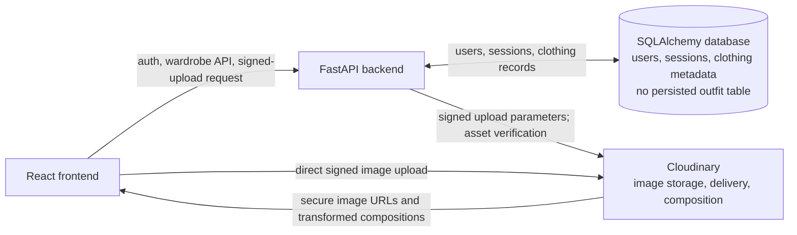
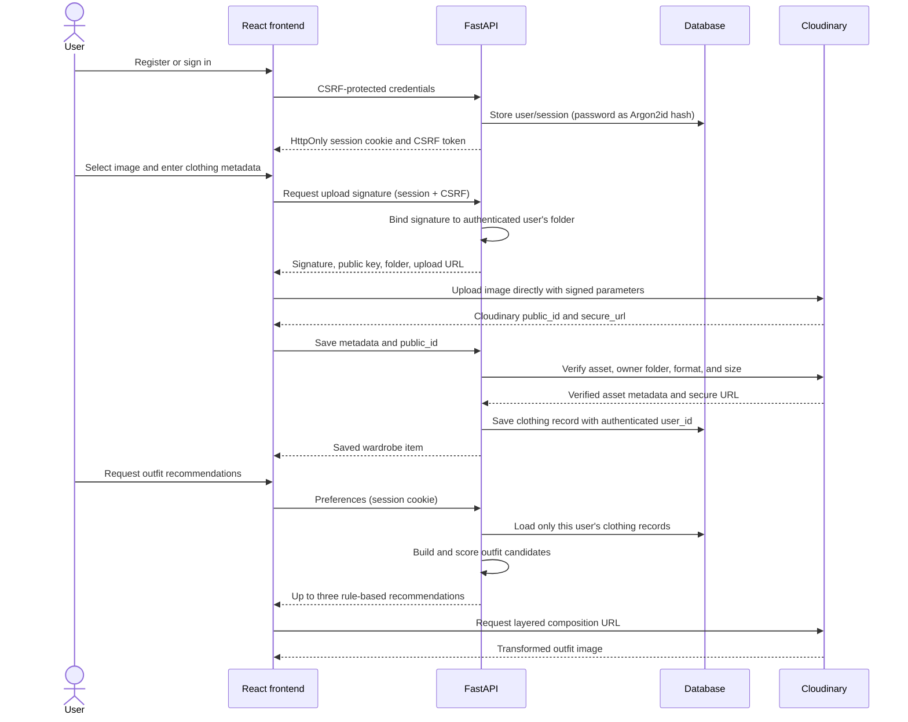

# WardrobeAI

**Your wardrobe. Your style. One intelligent closet.**

WardrobeAI turns a person's clothing collection into a searchable digital wardrobe and helps them assemble outfit ideas from pieces they already own. It addresses the familiar gap between owning clothes and knowing what is available, how pieces might work together, or what to wear for a particular occasion. The product combines a private, account-scoped closet with filters and preference-based outfit recommendations, helping people rediscover and make fuller use of what they have.

## Contents

- [Hackathon submission](#hackathon-submission)
- [Features and status](#features-and-status)
- [Cloudinary integration](#cloudinary-integration)
- [Technology stack](#technology-stack)
- [Architecture and data flow](#architecture-and-data-flow)
- [Setup](#setup)
- [Testing](#testing)
- [Security and privacy](#security-and-privacy)
- [Project structure](#project-structure)
- [Limitations and future scope](#limitations-and-future-scope)
- [Hackathon demo](#hackathon-demo)

## Hackathon Submission

- **Hackathon:** # Pixels to Products — Cloudinary AI Hackathon 2026
- **Organiser:** HackIndia
- **Track:** Your Media-Savvy Startup (open track)
- **Challenge:** Build a startup-style product where media is central to the user experience and Cloudinary performs meaningful media management, delivery, or transformation.

WardrobeAI fits the track because clothing photographs are core application data, not decorative content. Users upload wardrobe images to Cloudinary, receive CDN-delivered image URLs, and see outfit compositions assembled through Cloudinary image transformations. The product is intended for people who want to organise a personal wardrobe, find combinations for occasions, and get more use from their existing clothes. Its expected impact is less friction in managing a closet and more visibility into the clothing a user already owns; any sustainability benefit is an aspiration, not a measured result.

## Features and Status

**Implemented**

- Account registration and email/password login, with logout and a persistent server-side session.
- Argon2id password hashing and authenticated, user-specific wardrobes.
- Direct clothing photograph upload from the browser to Cloudinary using a signature issued by FastAPI.
- Clothing metadata entry and editing, including name, category, colour, pattern, style, occasion, season, brand, and notes.
- Search, filtering, sorting, pagination, wardrobe statistics, and item details.
- Rule-based outfit recommendations using the signed-in user's saved items and selected occasion/style/colour/season preferences.
- Cloudinary-generated layered image composition for recommendations when the pieces have Cloudinary public IDs.
- An authenticated clothing-recognition API that reads Cloudinary asset metadata and maps available tags and colours to basic attributes. The upload form currently asks the user to enter clothing details; it does not automatically call this recognition endpoint.
- Backend ownership checks on item reads, edits, deletes, upload signatures, asset verification, and recommendations.

**Not currently implemented as an end-user workflow**

- Automatic clothing recognition during upload, or a trained clothing-classification model.
- Reliable material, fit, pattern, or garment-shape detection.
- Persisted/saved outfit records. Recommendations are generated on request and returned in the API response.
- Weather or calendar integrations, packing lists, wardrobe usage analytics, or sustainability measurements.
- Active Cloudinary AI tagging or background removal. The API exposes capability status flags, but those transformations/add-ons are not invoked by the current product flow.

## Cloudinary Integration

Cloudinary stores and delivers clothing images and creates the layered image used to preview an outfit. The upload is direct from the browser to Cloudinary after an authenticated signature request; image bytes do not pass through FastAPI.

1. The signed-in frontend requests `POST /api/uploads/signature` and includes the CSRF token.
2. FastAPI creates a signature for the current user's fixed folder, `wardrobeai/users/{user_id}/clothing`, plus the timestamp and allowed formats (`jpg,png,webp`). It returns the signature, public API key, cloud name, folder, and upload URL. The API secret is only used on the backend to sign the parameters and is never returned.
3. The browser uploads the JPEG, PNG, or WebP file (maximum 10 MB) directly to Cloudinary using that signature and reports upload progress.
4. The frontend sends the Cloudinary `public_id` and manually entered clothing metadata to `POST /api/items`. FastAPI checks that the ID belongs to the authenticated user's folder, confirms the asset and its format/size with Cloudinary, and stores the verified ID and `secure_url` in the database.
5. Wardrobe images are delivered using the verified Cloudinary secure URL. The current wardrobe image component displays that URL directly; it does not request automatic quality/format optimization transformations. Recommendation compositions use a Cloudinary URL transformation with layered clothing assets, padding, and positioning.

The authenticated recognition endpoint requests Cloudinary Admin API resource metadata, including available colors, tags/context, faces, and image metadata. WardrobeAI maps any returned colors and existing tags/context to basic category and pattern guesses. It does not call a separate vision model, and it does not itself create Cloudinary AI tags. Cloudinary tagging/background-removal settings currently affect the reported capability status only; they do not activate an implemented tagging or background-removal workflow. Actual availability of Cloudinary metadata, add-ons, and transformations depends on the Cloudinary account configuration and plan. This project does not require or invoke a paid AI add-on as part of its current flow.

Responsibilities are divided as follows:

- **Cloudinary:** signed image uploads, asset storage, secure URL delivery, Admin API asset metadata, and URL-based outfit composition.
- **Python/FastAPI:** authentication, signature issuance and asset ownership verification, metadata validation and persistence, available-metadata interpretation, filtering, and rule-based recommendation scoring.



## Technology Stack

| Area | Technologies used |
| --- | --- |
| Frontend | React 19, TypeScript, Vite 6, plain CSS, Cloudinary React/URL generation packages |
| Backend | Python, FastAPI, Uvicorn, Pydantic, SQLAlchemy 2 |
| Database | SQLite by default at `backend/data/wardrobe.db`; `DATABASE_URL` can select another SQLAlchemy database when its Python driver is installed. A PostgreSQL driver is not included in the current requirements. |
| Images | Cloudinary Python SDK and Cloudinary upload/delivery APIs |
| Authentication | `argon2-cffi` Argon2id password hashes; random opaque session tokens stored as hashes in the database and issued in HttpOnly cookies; separate CSRF token/cookie/header checks |
| Other backend packages | `pydantic-settings`, `email-validator`, `httpx`, and `pytest` |
| Frontend tooling | TypeScript 5.9, ESLint 9, Vite React plugin |

## Architecture and Data Flow

**Registration and login:** the browser fetches a CSRF token, then sends registration/login requests. The backend validates credentials, creates a session record, and sets an HttpOnly session cookie and a separate CSRF cookie. The browser includes cookies with API requests. Logout revokes the session record.

**Upload and wardrobe:** the frontend validates the selected image and asks the authenticated backend to sign the upload parameters. It uploads directly to Cloudinary, then submits the Cloudinary asset ID and clothing fields to FastAPI. The backend verifies the asset belongs to the current user's folder before saving the record. Failed metadata saves trigger a best-effort request to discard the just-uploaded asset.

**Search and recommendations:** list and filter requests are scoped by authenticated user ID. For recommendations, the backend loads only that user's items, constructs dress or top-and-bottom outfit candidates, and scores category, style, occasion, colour, and season matches. The Cloudinary provider implementation selects the highest-scoring candidates and returns up to three; this is deterministic rule-based recommendation logic, not a generative AI model. Cloudinary then delivers a composed image URL for the selected pieces.



## Setup

### Prerequisites

- Git.
- Python 3.10 or newer (the code uses Pydantic 2 and current FastAPI dependencies).
- Node.js `^20.19.0` or `>=22.12.0`, as declared in `wardrobeAI/package.json`, plus npm.
- A Cloudinary account with the cloud name, API key, and API secret for uploads and asset management.

### Clone the repository

```bash
git clone https://github.com/HackIndiaXYZ/pixels-to-products-cloudinary-ai-hackathon-2026-sonacodes.git
cd pixels-to-products-cloudinary-ai-hackathon-2026-sonacodes
```

### Configure and start the backend

```bash
cd backend
python3 -m venv .venv
source .venv/bin/activate
python -m pip install -r requirements.txt
cp .env.example .env
```

Edit `backend/.env` and set the Cloudinary credentials. The API secret belongs only in this backend file; do not put it in a `VITE_` variable or commit the file.

| Backend variable | Default / purpose |
| --- | --- |
| `CLOUDINARY_CLOUD_NAME` | Empty; required for upload, asset verification/deletion, recognition, and the current recommendation provider. |
| `CLOUDINARY_API_KEY` | Empty; Cloudinary public API key, used by the server and included in the signed upload response. |
| `CLOUDINARY_API_SECRET` | Empty; server-only signing secret. |
| `DATABASE_URL` | Defaults to SQLite at `backend/data/wardrobe.db`. Other SQLAlchemy URLs need a matching installed driver. |
| `CORS_ORIGINS` | Defaults to localhost/127.0.0.1 Vite dev (`5173`) and preview (`4173`) origins. Set a comma-separated list for other origins. |
| `COOKIE_SECURE` | `false` for local HTTP; set `true` when serving over HTTPS. |
| `COOKIE_SAME_SITE` | `lax`; `none` requires `COOKIE_SECURE=true` for cross-site deployments. |
| `SESSION_TTL_HOURS` | `168` hours. |
| `CLOUDINARY_ENABLE_IMAGE_TAGGING` | `false`; capability-status switch only, not an active tagging workflow. |
| `CLOUDINARY_ENABLE_BACKGROUND_REMOVAL` | `false`; capability-status switch only, not an active background-removal workflow. |
| `AI_TIMEOUT_SECONDS` | `30`; current local recommendation scoring does not call an external AI provider. |

The complete placeholder template is [backend/.env.example](backend/.env.example). No real credentials are included in the repository. The database tables are initialized when the API starts; there is no separate migration command or migration framework. Startup also applies limited compatibility column additions for older SQLite clothing tables. Back up an existing database before upgrading. Existing legacy clothing rows without an owner remain unassigned and are not shown to registered users.

Run the API from the `backend` directory with the virtual environment active:

```bash
uvicorn app.main:app --reload --port 8000
```

The API is available at `http://127.0.0.1:8000`; health check: `http://127.0.0.1:8000/api/health`.

### Install and start the frontend

In a second terminal, from the repository root:

```bash
cd wardrobeAI
npm ci
npm run dev
```

Open `http://localhost:5173`. Vite proxies `/api` requests to `http://127.0.0.1:8000`. Optional frontend variables are listed in [wardrobeAI/.env.example](wardrobeAI/.env.example); `VITE_API_BASE_URL` can stay empty for local development, and the cloud name can be read from the backend health endpoint. No Cloudinary secret belongs in frontend configuration.

## Testing

### Automated checks

Run backend tests from `backend` with the virtual environment active. Cloudinary network calls are mocked in the tests, so no Cloudinary credentials are required for the test suite.

```bash
cd backend
pytest
```

Run the frontend production build and lint from `wardrobeAI`:

```bash
cd wardrobeAI
npm run build
npm run lint
```

The tests cover authentication, password hashing, CSRF enforcement, unauthenticated access, cross-user item isolation, search/filtering, asset verification, and signature contents. These commands are documented as available checks; their results depend on running them in the current environment.

### End-to-end manual check

1. Start the API and frontend, then open `http://localhost:5173`. The public landing page should load without signing in.
2. Register an account with a valid email and a password of at least 12 characters that meets the form's strength checks. Registration should sign the new user in and open `/app`.
3. Log out, sign back in, and confirm the wardrobe is only available after authentication. The browser's protected app flow redirects an unauthenticated visitor to login; protected API calls return `401`.
4. In the wardrobe, add a JPEG, PNG, or WebP image no larger than 10 MB and complete the clothing fields. A successful save should create a visible item.
5. In the Cloudinary Media Library, find the uploaded asset under `wardrobeai/users/<user-id>/clothing`. Confirm it is an image and that its delivered URL uses HTTPS. Folder naming is an ownership convention, not URL privacy.
6. Confirm metadata in the UI or by requesting `GET /api/items` while signed in. Optionally inspect the local default SQLite database with the `sqlite3` command-line utility:

	 ```bash
	 sqlite3 backend/data/wardrobe.db 'SELECT id, user_id, name, category, cloudinary_public_id FROM clothing_items;'
	 ```

7. Search for an item's name and apply category, colour, pattern, style, or occasion filters. Results should match the query and remain paginated.
8. Add compatible wardrobe pieces (for example, a top and bottoms), choose recommendation preferences, and select **Generate outfits**. The API should return up to three scored combinations drawn from the signed-in user's available items. A generated composition is returned as a Cloudinary transformation URL; outfit records are not saved.
9. To check isolation, register a second account in a separate browser profile. Its wardrobe and recommendations should contain only its own items. Requests to fetch, update, or delete the first user's item by ID should return `404`; a foreign upload public ID should be rejected.
10. While signed out, try `GET /api/items`, `GET /api/stats`, or `POST /api/uploads/signature` using an API client. Each protected request should return `401`. State-changing authenticated requests without a valid CSRF token should be rejected.

For production-like behavior, test with a non-production Cloudinary account and never paste real user data or credentials into issues, logs, or screenshots.

## Security and Privacy

- Passwords are hashed using Argon2id before they are stored. Session tokens are random opaque values; only token digests are stored in the database.
- The session is an HttpOnly cookie. A separate CSRF token is required for state-changing requests. Authentication and ownership checks are enforced by FastAPI, not just by frontend route handling.
- Wardrobe queries include the authenticated user ID. The backend generates the signed upload folder from that ID and verifies the `public_id` prefix and Cloudinary asset before saving it. Clients cannot choose another user's folder for a valid signed upload, and API item operations are scoped to the current user.
- The Cloudinary API secret stays on the backend. The browser receives only the API key and signature needed for the signed direct upload.
- **Cloudinary images are not private just because they are stored in a user-named folder.** The current app stores and delivers standard secure Cloudinary URLs; anyone who obtains a public asset URL may be able to view that asset. Do not put sensitive photographs in this app unless access-controlled Cloudinary delivery is separately configured and implemented.
- For production, use HTTPS with `COOKIE_SECURE=true`, exact trusted `CORS_ORIGINS`, and a persistent database. The built-in login/registration limiter is process-local and should be replaced with shared rate limiting when running multiple workers or instances.

## Project Structure

```text
backend/
	app/
		ai/                 Recognition metadata mapping and recommendation scoring
		routers/            Auth, uploads, items, stats, health, and AI endpoints
		services/           Cloudinary and wardrobe service logic
		auth_security.py    Password hashing, session token helpers, rate limiter
		config.py           Environment-backed settings
		database.py         SQLAlchemy engine and startup table initialization
	data/                 Default SQLite database location
	tests/                Backend auth, ownership, upload, and wardrobe tests
	.env.example          Backend configuration template
wardrobeAI/
	src/auth/             Public landing, registration, login, and auth context
	src/components/       Wardrobe dashboard, item forms, cards, and modals
	src/api/              FastAPI client and signed Cloudinary upload helper
	src/hooks/            Wardrobe state and data loading
	src/cloudinary/       Cloudinary configuration and image components
	.env.example          Optional Vite variables
	package.json          Scripts and frontend dependencies
```

Other useful files: [backend/README.md](backend/README.md) documents the API endpoints and deletion behavior; [wardrobeAI/README.md](wardrobeAI/README.md) contains frontend-specific setup notes.

## Limitations and Future Scope

- Improve garment recognition with a dedicated clothing model and make confidence/uncertainty visible; current recognition is a basic mapping of Cloudinary metadata and existing tags.
- Improve material, pattern, garment shape, and colour detection.
- Add weather-aware recommendations, calendar outfit planning, and packing recommendations.
- Let users save and revisit generated outfits, and develop more advanced outfit visualisation.
- Add wardrobe usage and sustainability insights with transparent, measurable assumptions.
- Add access-controlled image delivery if private image URLs are a product requirement.

## Hackathon Demo

1. Open the public landing page at `http://localhost:5173`.
2. Register or sign in to show the authenticated wardrobe experience.
3. Upload a clothing item and point out that metadata is entered by the user while the image is uploaded directly to Cloudinary.
4. Show the digital wardrobe, then search or filter its items.
5. Choose occasion/style preferences and generate outfit recommendations. Explain that current recommendations use deterministic rules over saved metadata, and that the composition is a Cloudinary image transformation.
6. Show the Cloudinary asset in the Media Library and explain the signed-upload flow: FastAPI signs a user-specific folder request, while the browser sends the image directly to Cloudinary. The API secret remains server-side.
7. Demonstrate user isolation with a second account or browser profile. Show that its closet differs and that item IDs from the first account are not accessible through the second account's API session.
